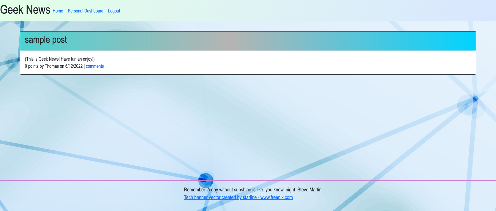

# Geek News

## Table of Contents:

1. [Description](#description)
2. [Instructions](#instructions)
3. [Use](#use)
4. [Contribute](#contribute)
5. [Tests](#tests)
6. [License](#license)
7. [GitHub](#github)
8. [E-mail](#e-mail)
9. [Links](#links)
10. [Sources](#sources)
11. [Picture](#picture)

## Description

Geek News is a forum type social media site where people can share thoughts and ideas for anything "geeky"

## Instructions

The application can be reached via the URL provided below. In order to edit the application, code will need to be downloaded and dependencies installed.

## Use

It should be used for fun.

## Contribute

This project is not open to contributions at this time.

## Tests

Tests were written for helper functions using jest.

## License

## GitHub

rehpotsirhc21

## E-mail

langnerc@icloud.com

## Links

Heroku: https://pure-lowlands-99427.herokuapp.com/

gitHub: https://github.com/rehpotsirhc21/geek-blog

## Sources

The Just-Tech-News module project was used as a base for this since its essentially the same functionality.

## Picture

